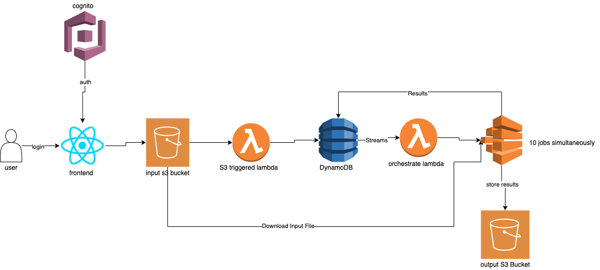
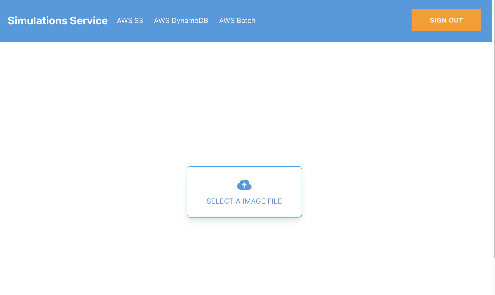

# Simulations Service

This service provides functionality for running 10 different simulations using an input image from web app.

CI/CD is built by using AWS CDK and AWS Amplify. Both of the tools can be integrated with Github Actions or similar tool to run the tests before the deployment.

## System Design



Main flow:
1. User visits the React frontend served with Amazon Cloudfront/S3
2. User authenticates using Amazon Cognito
3. User uploads an image file to run simulations
4. React app uploads the image file to S3 bucket
5. A lambda triggered from S3 upload and writes file name and S3 location to DynamoDB with status of "NEW" with a unique job id and simulation number
6. DynamoDB Streams triggers another lambda for each job id and simulation combination and starts batch job using simulation number as environment variable
7. Batch jobs builds the docker image, replaces input file according to simulation number, downloads the input file from S3, calculates the results
8. Calculated results pushed to Output S3 by batch job
9. Calculated results rewritten to DynamoDB job id and simulation number table with a status of "PROCESSED"

There are two main components:

1. Simulation Service Serverless Backend
2. Simulation Frontend

## 1. Simulation Service Serverless Backend
Backend uses AWS CDK to orchestrate infastructure of the AWS resources described above.

After installing AWS CDK, backend can be deployed using:
```cdk deploy```


## 2. Simulation Frontend



Frontend uses React, AWS Amplify and AWS Cognito to upload user files to S3 bucket.

In order to run frontend locally,
```npm install```

```npm start```

In order to deploy fronntend,
```amplify configure```

```amplify init```

```amplify publish```

